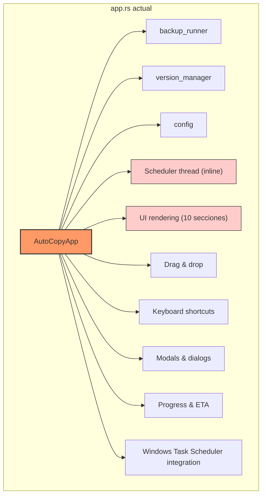
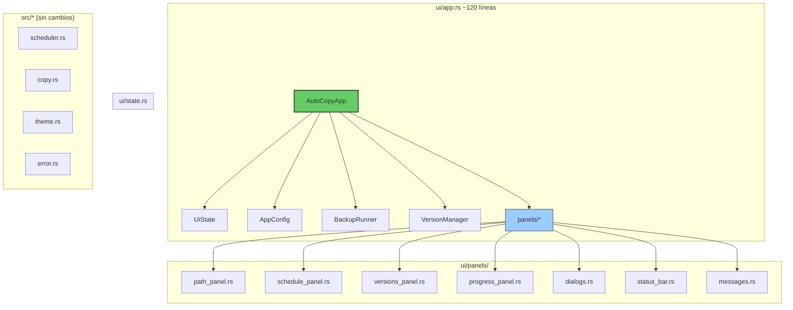
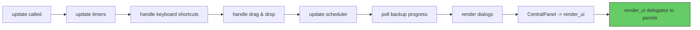

# AutoCopy — Arquitectura y Plan de Refactorización

> **Estado:** Este documento describe la arquitectura objetivo y la hoja de ruta para
> refactorizar el módulo `ui/app.rs`, que actualmente concentra demasiadas
> responsabilidades (~947 líneas).  
> **Documento complementario:** [`specs.md`](./specs.md) — especificaciones técnicas detalladas de cada módulo.

---

## Índice

1. [Problema actual](#1-problema-actual)
2. [Arquitectura objetivo](#2-arquitectura-objetivo)
3. [Estructura de directorios (target)](#3-estructura-de-directorios-target)
4. [Desglose de módulos](#4-desglose-de-módulos)
5. [Plan de migración paso a paso](#5-plan-de-migración-paso-a-paso)
6. [Beneficios esperados](#6-beneficios-esperados)

---

## 1. Problema actual

### 1.1. Síntomas

| Síntoma | Detalle |
|---|---|
| **Archivo gigante** | `ui/app.rs` tiene ~947 líneas. |
| **`render_ui` monstruoso** | ~510 líneas con 10 secciones distintas. |
| **`update` sobrecargado** | ~208 líneas que mezclan timers, scheduler, D&D, shortcuts, diálogos y render. |
| **`#[allow(clippy::too_many_lines)]`** | El linter ya advierte que `render_ui` es inmantenible. |
| **Struct hinchado** | `AutoCopyApp` tiene ~30 campos que mezclan dominio y UI. |

### 1.2. Violaciones de diseño



**Problemas de diseño:**

- **SRP violado**: `AutoCopyApp` es responsable de UI, lógica de negocio, scheduling, persistencia, drag & drop, atajos de teclado, diálogos, etc.
- **Alto acoplamiento**: El scheduler se spawnea como un `thread::spawn` dentro de `update()`. No se puede testear ni reutilizar.
- **Estado plano**: Los ~30 campos del struct no están agrupados por responsabilidad. Los flags de UI conviven con campos de configuración.
- **Sin testabilidad**: `render_ui` y `update` no pueden ser unit-testeadas porque mezclan lógica con rendering de egui.

---

## 2. Arquitectura objetivo

### 2.1. Principios rectores

1. **Separación de responsabilidades (SRP)** — Cada archivo/struct tiene una responsabilidad clara.
2. **Composición sobre herencia** — `AutoCopyApp` compone sub-estructuras en lugar de tener 30 campos sueltos.
3. **Paneles autocontenidos** — Cada sección de UI vive en su propio archivo y recibe solo los datos que necesita.
4. **Lógica extraíble** — El scheduler interno, la validación, los cálculos de ETA, etc. se mueven a funciones libres o structs separados testeables.
5. **Estado vs Presentación** — El estado del dominio (`AppConfig`, `BackupRunner`, `VersionManager`) se separa del estado puramente UI (timers, diálogos, mensajes).

### 2.2. Diagrama de arquitectura objetivo



### 2.3. Flujo de `update()` objetivo



Cada paso del `update()` será un método privado de ~5–15 líneas, no un bloque monolítico de 200 líneas.

---

## 3. Estructura de directorios (target)

```
src/
├── main.rs                        # (sin cambios)
├── lib.rs                         # (sin cambios)
├── config.rs                      # (sin cambios)
├── copy.rs                        # (sin cambios)
├── backup_runner.rs               # (sin cambios)
├── version_manager.rs             # (sin cambios)
├── scheduler.rs                   # (sin cambios)
├── error.rs                       # (sin cambios)
├── theme.rs                       # (sin cambios)
└── ui/
    ├── mod.rs                     # Re-exporta AutoCopyApp (sin cambios)
    ├── app.rs                     # ORQUESTADOR (~120 líneas)
    ├── components.rs              # Componentes compartidos (sin cambios)
    ├── state.rs                   # UiState: estado exclusivo de UI
    └── panels/
        ├── mod.rs                 # Re-exporta todas las funciones panel
        ├── header.rs              # Logo + título
        ├── path_panel.rs          # Selectores origen/destino
        ├── schedule_panel.rs      # Checkbox, time picker, Winsched
        ├── versions_panel.rs      # Lista, sort, filter, open/delete
        ├── progress_panel.rs      # Barra de progreso, ETA, velocidad
        ├── dialogs.rs             # Confirmación de cancelación y delete
        ├── messages.rs            # Error / Success indicators
        └── status_bar.rs          # Estado, último backup, atribución
```

---

## 4. Desglose de módulos

### 4.1. `ui/state.rs` — Estado de UI (nuevo)

Extrae todos los campos de `AutoCopyApp` que son **exclusivos de presentación**:

```rust
pub struct UiState {
    pub backup_active: bool,
    pub error_message: Option<String>,
    pub success_message: Option<String>,
    pub last_backup_time: Option<String>,
    pub scheduling_active: bool,
    pub next_backup_display: Option<String>,
    pub source_valid: Option<bool>,
    pub dest_valid: Option<bool>,
    pub show_cancel_dialog: bool,
    pub success_timer: Option<DateTime<Local>>,
    pub pending_delete: Option<PathBuf>,
    pub config_saved_at: Option<DateTime<Local>>,
    pub winsched_active: bool,
    pub logo: Option<egui::TextureHandle>,
}
```

**Beneficio:** `AutoCopyApp` pasa de ~30 a ~16 campos, y `UiState` puede ser manipulado sin tocar el dominio.

### 4.2. `ui/panels/` — Paneles de UI (nuevo)

Cada panel es una función pública que recibe **solo los datos que necesita**. Ejemplo:

```rust
// panels/path_panel.rs
pub fn render(
    ui: &mut egui::Ui,
    source_path: &mut Option<PathBuf>,
    dest_path: &mut Option<PathBuf>,
    source_valid: Option<bool>,
    dest_valid: Option<bool>,
    version_mgr: &mut VersionManager,
    theme: &AppTheme,
) -> bool { /* ... */ }
```

| Panel | Responsabilidad | Líneas estimadas |
|---|---|---|
| `header.rs` | Logo + título | ~25 |
| `path_panel.rs` | Selectores origen/destino, espacio disponible | ~60 |
| `schedule_panel.rs` | Checkbox, time picker, Winsched integration | ~90 |
| `versions_panel.rs` | Lista, sort, filter, open/delete | ~90 |
| `progress_panel.rs` | Barra de progreso, archivo actual, ETA | ~50 |
| `dialogs.rs` | Confirmación cancelar y eliminar | ~50 |
| `messages.rs` | Error / Success indicators | ~25 |
| `status_bar.rs` | Estado, último backup, atribución | ~30 |

### 4.3. `ui/app.rs` — Orquestador (refactorizado)

```rust
pub struct AutoCopyApp {
    // Dominio
    config: AppConfig,
    source_path: Option<PathBuf>,
    dest_path: Option<PathBuf>,
    max_versions: usize,
    schedule_enabled: bool,
    schedule_time: String,
    schedule_hour: u32,
    schedule_minute: u32,
    runner: BackupRunner,
    version_mgr: VersionManager,
    // UI state
    ui: UiState,
}
```

**`render_ui()` objetivo (~40 líneas):**

```rust
pub fn render_ui(&mut self, ui: &mut egui::Ui) {
    let theme = AppTheme::from_visuals(&ui.style().visuals);

    panels::header::render(ui, &self.ui.logo, &theme);
    panels::path_panel::render(
        ui, &mut self.source_path, &mut self.dest_path,
        self.ui.source_valid, self.ui.dest_valid,
        &mut self.version_mgr, &theme,
    );
    panels::schedule_panel::render(
        ui, self, &mut self.ui, &theme,
    );
    panels::versions_panel::render(
        ui, &mut self.version_mgr, &mut self.ui.pending_delete, &theme,
    );
    panels::progress_panel::render(ui, &self.runner, &theme);
    panels::messages::render(ui, &mut self.ui, &theme);
    panels::status_bar::render(ui, &self.runner, &self.ui, &theme);
}
```

---

## 5. Plan de migración paso a paso

Cada paso es reversible y produce código compilable entre cambios.

### Fase 1 — Extracción de `state.rs` (bajo riesgo)

1. Crear `src/ui/state.rs` con el struct `UiState`.
2. Agregar `pub mod state;` en `ui/mod.rs`.
3. En `app.rs`, agregar campo `ui: UiState` y poblar desde `new()`.
4. Migrar cada acceso a los campos viejos (`self.error_message` → `self.ui.error_message`).
5. **Checkpoint**: `app.rs` se reduce en ~15 campos y la lógica no cambia.

### Fase 2 — Extracción de paneles (riesgo medio)

1. Crear `src/ui/panels/` con su `mod.rs`.
2. Extraer los paneles de UI **uno por uno**, en este orden recomendado (del más independiente al más acoplado):

   | Orden | Panel | Dependencias |
   |---|---|---|
   | 1 | `header.rs` | Solo `logo: &Option<TextureHandle>` |
   | 2 | `messages.rs` | `UiState` (2 campos) |
   | 3 | `status_bar.rs` | `UiState` + `BackupRunner` (lectura) |
   | 4 | `progress_panel.rs` | `BackupRunner` (solo lectura) |
   | 5 | `path_panel.rs` | `source_path`, `dest_path`, `version_mgr` |
   | 6 | `versions_panel.rs` | `version_mgr`, `pending_delete` |
   | 7 | `schedule_panel.rs` | `AutoCopyApp` (varios campos) |
   | 8 | `dialogs.rs` | `UiState` + `version_mgr` |

3. Por cada panel extraído:
   - Copiar el código a su nuevo archivo.
   - Reemplazar en `render_ui()` con la llamada a `panels::xxx::render(...)`.
   - Compilar y verificar que funciona.

### Fase 3 — Limpieza de `update()` (riesgo medio)

1. Extraer cada bloque de `update()` a un método privado en `AutoCopyApp`:

   ```rust
   fn handle_auto_dismiss_timers(&mut self) { /* ... */ }
   fn handle_keyboard_shortcuts(&mut self, ctx: &egui::Context) { /* ... */ }
   fn handle_drag_and_drop(&mut self, ctx: &egui::Context) { /* ... */ }
   fn update_scheduler(&mut self) { /* ... */ }
   fn poll_backup_progress(&mut self) { /* ... */ }
   fn render_dialogs(&mut self, ctx: &egui::Context) { /* ... */ }
   ```

2. `update()` final:

   ```rust
   fn update(&mut self, ctx: &egui::Context, _frame: &mut eframe::Frame) {
       self.update_next_backup_display();
       self.validate_path_fields();
       self.handle_auto_dismiss_timers();
       self.handle_logo_lazy_load(ctx);
       self.handle_keyboard_shortcuts(ctx);
       self.handle_drag_and_drop(ctx);
       self.update_scheduler();
       self.poll_backup_progress();
       self.render_dialogs(ctx);
       egui::CentralPanel::default().show(ctx, |ui| self.render_ui(ui));
   }
   ```

### Fase 4 — Extraer scheduler a un struct propio (opcional, riesgo alto)

Si se quiere eliminar el `thread::spawn` de `update()`:

1. Crear `src/scheduler_internal.rs` (o extender `scheduler.rs` si aplica).
2. Mover la lógica del hilo a un struct `InternalScheduler` que maneje `Arc<AtomicBool>` y tenga métodos `start()`, `stop()`, `is_running()`.
3. `AutoCopyApp` tendría `scheduler: Option<InternalScheduler>`.

---

## 6. Beneficios esperados

| Métrica | Antes | Después |
|---|---|---|
| `app.rs` líneas totales | ~947 | ~120 |
| `render_ui()` líneas | ~510 | ~40 |
| `update()` líneas | ~208 | ~30 |
| Struct `AutoCopyApp` campos | ~30 | ~16 (dominio) + `ui: UiState` |
| Archivos en `ui/` | 3 | 11 |
| Testeabilidad unitaria | ❌ (nula) | ✅ alta (paneles y lógica separados) |
| Riesgo de regression al cambiar UI | Alto | Bajo (cada panel aislado) |
| Facilidad para añadir nueva sección | Baja (hay que tocar el monolito) | Alta (nuevo archivo panel) |

---

## Apéndice: Glosario de términos

| Término | Significado |
|---|---|
| **SRP** | Single Responsibility Principle — cada módulo debe tener una única razón para cambiar. |
| **Panel** | Función que renderiza una sección de la UI. Recibe datos por parámetro, no tiene estado propio. |
| **UiState** | Struct que agrupa todo el estado transitorio de la UI (mensajes, timers, diálogos). |
| **Winsched** | Integración con Windows Task Scheduler (`schtasks.exe`). |
| **ETA** | Estimated Time of Arrival — tiempo restante estimado para completar el backup. |
| **D&D** | Drag & Drop — arrastrar y soltar carpetas desde el explorador. |
