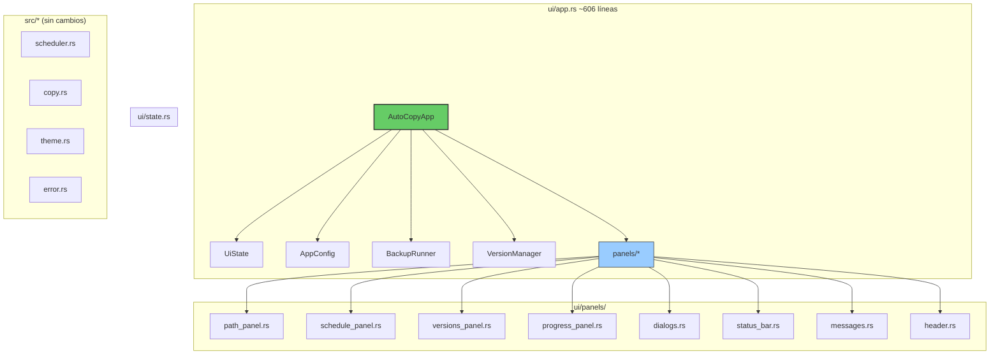

# AutoCopy — Documentación de Arquitectura

> **Documento complementario:** [`specs.md`](./specs.md) — especificaciones técnicas detalladas de cada módulo.

---

## Índice

1. [Arquitectura general](#1-arquitectura-general)
2. [Estructura de directorios](#2-estructura-de-directorios)
3. [Desglose de módulos](#3-desglose-de-módulos)
4. [Flujo de `update()`](#4-flujo-de-update)
5. [Apéndice: Glosario de términos](#5-apéndice-glosario-de-términos)

---

## 1. Arquitectura general

### 1.1. Principios

1. **Separación de responsabilidades (SRP)** — Cada archivo/struct tiene una responsabilidad clara.
2. **Composición sobre herencia** — `AutoCopyApp` compone sub-estructuras en lugar de tener campos sueltos.
3. **Paneles autocontenidos** — Cada sección de UI vive en su propio archivo y recibe solo los datos que necesita.
4. **Lógica extraíble** — El scheduler interno, la validación, los cálculos de ETA, etc. están en funciones libres o structs separados.
5. **Estado vs Presentación** — El estado del dominio (`AppConfig`, `BackupRunner`, `VersionManager`) se separa del estado puramente UI (timers, diálogos, mensajes).

### 1.2. Diagrama de arquitectura



---

## 2. Estructura de directorios

```
src/
├── main.rs                        # Punto de entrada
├── lib.rs                         # Re-exportaciones
├── config.rs                      # Configuración persistente (JSON)
├── copy.rs                        # Lógica de copia de archivos
├── backup_runner.rs               # Ejecutor de backups en segundo plano
├── version_manager.rs             # Gestión de versiones (listar, ordenar, eliminar)
├── scheduler.rs                   # Integración con Windows Task Scheduler (schtasks)
├── error.rs                       # Tipos de error unificados
├── theme.rs                       # Paleta de colores themable (oscuro/claro)
└── ui/
    ├── mod.rs                     # Re-exporta AutoCopyApp
    ├── app.rs                     # Orquestador principal (~606 líneas)
    ├── components.rs              # Componentes compartidos (path_row, format_size, open_in_explorer)
    ├── state.rs                   # UiState: estado exclusivo de UI
    └── panels/
        ├── mod.rs                 # Re-exporta todas las funciones panel
        ├── header.rs              # Logo + título
        ├── path_panel.rs          # Selectores origen/destino, espacio disponible
        ├── schedule_panel.rs      # Checkbox, time picker, Winsched
        ├── versions_panel.rs      # Lista, sort, filter, open/delete
        ├── progress_panel.rs      # Barra de progreso, ETA, velocidad
        ├── dialogs.rs             # Confirmación de cancelación y delete
        ├── messages.rs            # Error / Success indicators
        └── status_bar.rs          # Estado, último backup, atribución
```

---

## 3. Desglose de módulos

### 3.1. `src/ui/app.rs` — Orquestador principal

El struct `AutoCopyApp` compone todos los subsistemas del proyecto:

```rust
pub struct AutoCopyApp {
    // — Configuración
    config: AppConfig,
    source_path: Option<PathBuf>,
    dest_path: Option<PathBuf>,
    max_versions: usize,
    schedule_enabled: bool,
    schedule_time: String,
    schedule_hour: u32,
    schedule_minute: u32,

    // — Servicios
    runner: BackupRunner,
    version_mgr: VersionManager,

    // — Control del scheduler interno
    scheduler_cancel: Arc<AtomicBool>,
    winsched_flag: Arc<AtomicBool>,

    // — Estado de UI (separado)
    ui: UiState,
}
```

Su método `update()` (implementación de `eframe::App`) delega en métodos privados y luego en los paneles de UI:

```rust
fn update(&mut self, ctx: &egui::Context, _frame: &mut eframe::Frame) {
    let now = Local::now();
    self.update_next_backup_display_with(now);
    self.validate_path_fields();
    self.handle_auto_dismiss_timers_with(now);
    self.handle_logo_lazy_load(ctx);
    self.handle_keyboard_shortcuts(ctx);
    self.handle_drag_and_drop(ctx);
    self.update_scheduler();
    self.poll_backup_progress();
    self.render_dialogs(ctx);
    egui::CentralPanel::default().show(ctx, |ui| self.render_ui(ui));
}
```

### 3.2. `src/ui/state.rs` — Estado de UI

Agrupa todo el estado transitorio de presentación, separado del dominio:

```rust
pub struct UiState {
    pub backup_active: bool,
    pub error_message: Option<String>,
    pub success_message: Option<String>,
    pub last_backup_time: Option<String>,
    pub scheduler_running: bool,
    pub next_backup_display: Option<String>,
    pub source_valid: Option<bool>,
    pub dest_valid: Option<bool>,
    pub show_cancel_dialog: bool,
    pub success_timer: Option<DateTime<Local>>,
    pub pending_delete: Option<PathBuf>,
    pub config_saved_at: Option<DateTime<Local>>,
    pub winsched_active: bool,
    pub logo: Option<egui::TextureHandle>,
    // Dirty flags & caches para debounce de I/O
    pub paths_dirty: bool,
    pub space_cache: Option<(u64, DateTime<Local>)>,
    pub last_schedule_time_parsed: Option<String>,
}
```

### 3.3. `src/ui/panels/` — Paneles de UI

Cada panel es una función pública `render()` que recibe solo los datos que necesita. Ningún panel tiene estado propio.

| Panel | Responsabilidad | Líneas |
|---|---|---|
| `header.rs` | Logo + título | ~15 |
| `path_panel.rs` | Selectores origen/destino, espacio disponible | ~65 |
| `schedule_panel.rs` | Checkbox, time picker, Winsched integration | ~215 |
| `versions_panel.rs` | Lista, sort, filter, open/delete | ~127 |
| `progress_panel.rs` | Barra de progreso, archivo actual, ETA | ~54 |
| `dialogs.rs` | Confirmación cancelar y eliminar | ~77 |
| `messages.rs` | Error / Success indicators | ~25 |
| `status_bar.rs` | Estado, último backup, atribución | ~52 |

#### `header.rs`
Renderiza el logo del producto (cargado desde `icons/icon_autocopy.png`) con un espaciado superior.

#### `path_panel.rs`
Dibuja los campos de texto para origen y destino, cada uno con:
- Validación visual (checkmark o cruz)
- Botón "Examinar..." que abre un diálogo nativo (`rfd::FileDialog`)
- Botón para abrir la carpeta en el explorador
- Muestra el espacio disponible en el destino (con caché de 5 segundos)

#### `schedule_panel.rs`
Configuración del respaldo automático:
- Checkbox para activar/desactivar
- Sliders de hora y minuto (formato 24h)
- Indicador de próxima ejecución
- Integración con Windows Task Scheduler (crear/eliminar tarea `schtasks`)

#### `versions_panel.rs`
Lista de versiones guardadas con:
- Ordenamiento (más recientes, más antiguas, más grandes)
- Filtro por texto
- Scroll area con botones "Abrir" y "🗑" por cada versión

#### `progress_panel.rs`
Barra de progreso durante un backup activo:
- Porcentaje y contador de archivos
- Nombre del archivo actual
- Velocidad y ETA

#### `dialogs.rs`
Diálogos modales:
- Confirmación de cancelación de respaldo
- Confirmación de eliminación de versión

#### `messages.rs`
Mensajes de error y éxito con botón "Aceptar" para descartarlos.

#### `status_bar.rs`
Barra inferior con:
- Estado actual (Respaldando... / Programado: ... / Inactivo)
- Último backup realizado
- Atribución ("Desarrollado por JhosenthG")

### 3.4. `src/ui/components.rs` — Componentes compartidos

Funciones reutilizables por varios paneles:

- `format_size(bytes: u64) -> String` — Formatea bytes a KB/MB/GB legible.
- `open_in_explorer(path: &PathBuf)` — Abre una carpeta en el explorador de Windows.
- `path_row(...)` — Dibuja un selector de ruta (campo de texto + botón Examinar + indicador de validación + botón abrir).

### 3.5. `src/` — Módulos de dominio (sin cambios)

#### `config.rs`
Carga y guarda la configuración en un archivo JSON (`config.json`). Campos: `last_source`, `last_dest`, `max_versions`, `schedule_enabled`, `schedule_time`.

#### `copy.rs`
Contiene la lógica central de copia de archivos:
- `validate_paths()` — Valida que origen y destino sean válidos y distintos.
- `perform_backup()` — Copia archivos de origen a destino con barra de progreso.
- `cleanup_old_versions()` — Elimina versiones antiguas según `max_versions`.
- `get_available_space()` — Consulta el espacio libre en una unidad.

#### `backup_runner.rs`
Struct `BackupRunner` que ejecuta `perform_backup()` en un hilo separado. Expone:
- `start()` — Inicia el backup.
- `cancel()` — Solicita cancelación.
- `poll()` — Revisa si el backup terminó y actualiza el progreso.
- `compute_eta()` — Calcula velocidad y tiempo restante.

#### `version_manager.rs`
Struct `VersionManager` que gestiona las versiones de respaldo en el destino:
- `refresh()` — Escanea el directorio destino.
- `set_dest()` — Cambia el directorio destino.
- `delete_version()` — Elimina una versión.
- `SortOrder` — Enum: `Newest`, `Oldest`, `Largest`.
- `folder_size()` — Calcula el tamaño total de una carpeta.

#### `scheduler.rs`
Integración con Windows Task Scheduler mediante `schtasks.exe`:
- `schedule_backup_task()` — Crea una tarea diaria programada.
- `unschedule_backup_task()` — Elimina la tarea.
- `is_scheduled()` — Consulta si la tarea existe.

#### `theme.rs`
Struct `AppTheme` que deriva una paleta de colores desde los `Visuals` de egui, adaptándose automáticamente al tema oscuro o claro del sistema.

#### `error.rs`
Enum `BackupError` con variantes para cada tipo de error del dominio: `InvalidPath`, `InvalidScheduleTime`, `SchedulingFailed`, `IoError`, etc.

---

## 4. Flujo de `update()`


Cada paso del `update()` es un método privado de `AutoCopyApp` de ~5–15 líneas. El orden es:

1. **`update_next_backup_display`** — Calcula cuándo será el próximo respaldo programado ("hoy 14:30" / "mañana 14:30").
2. **`validate_path_fields`** — Valida que las rutas existan (solo si `paths_dirty` es true).
3. **`handle_auto_dismiss_timers`** — Descarta mensajes de éxito después de 3 segundos y el indicador "Guardado" después de 1.5 segundos.
4. **`handle_logo_lazy_load`** — Carga la imagen del logo una sola vez desde los bytes embebidos.
5. **`handle_keyboard_shortcuts`** — Atajos: Ctrl+B (backup), Ctrl+S (guardar), Escape (cerrar diálogos/mensajes).
6. **`handle_drag_and_drop`** — Procesa carpetas arrastradas: mitad superior → origen, mitad inferior → destino.
7. **`update_scheduler`** — Spawnea/Detiene el hilo del scheduler interno según `schedule_enabled`.
8. **`poll_backup_progress`** — Consulta si el backup en segundo plano terminó.
9. **`render_dialogs`** — Renderiza diálogos modales (cancelar, eliminar).
10. **`render_ui`** — Renderiza todos los paneles dentro de `CentralPanel`.

---

## 5. Apéndice: Glosario de términos

| Término | Significado |
|---|---|
| **SRP** | Single Responsibility Principle — cada módulo debe tener una única razón para cambiar. |
| **Panel** | Función que renderiza una sección de la UI. Recibe datos por parámetro, no tiene estado propio. |
| **UiState** | Struct que agrupa todo el estado transitorio de la UI (mensajes, timers, diálogos). |
| **Winsched** | Integración con Windows Task Scheduler (`schtasks.exe`). |
| **ETA** | Estimated Time of Arrival — tiempo restante estimado para completar el backup. |
| **D&D** | Drag & Drop — arrastrar y soltar carpetas desde el explorador. |
