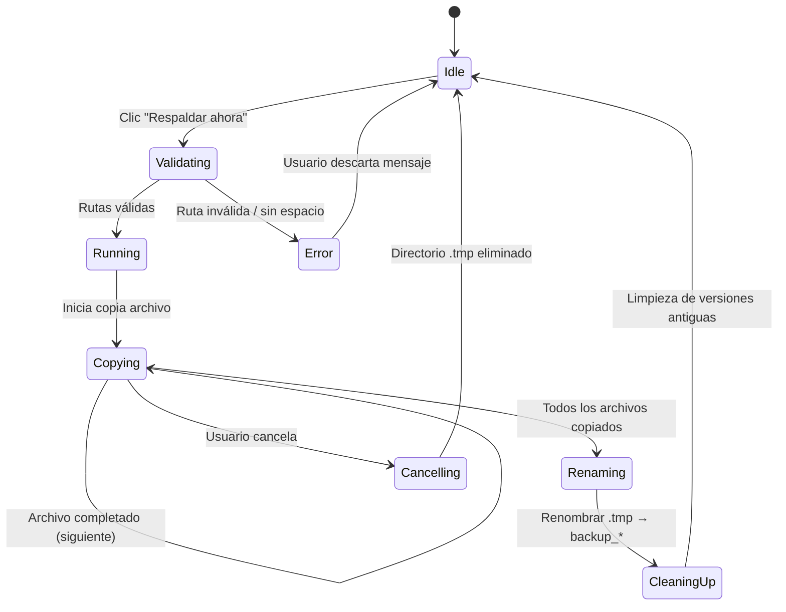

# AutoCopy — Especificaciones Técnicas

> **Versión:** 0.2.0  
> **Propósito:** Herramienta de respaldo con versionado automático para Windows  
> **Repositorio:** <https://github.com/jhosenthG/project_autocopy>

---

## Índice

1. [Resumen del Proyecto](#1-resumen-del-proyecto)
2. [Stack Tecnológico](#2-stack-tecnológico)
3. [Estructura del Proyecto](#3-estructura-del-proyecto)
4. [Arquitectura General](#4-arquitectura-general)
5. [Módulos en Detalle](#5-módulos-en-detalle)
   - 5.1. `main.rs` — Punto de entrada
   - 5.2. `config.rs` — Configuración persistente
   - 5.3. `copy.rs` — Motor de copia y validación
   - 5.4. `backup_runner.rs` — Ejecutor con progreso
   - 5.5. `version_manager.rs` — Gestión de versiones
   - 5.6. `scheduler.rs` — Programador de Windows
   - 5.7. `error.rs` — Jerarquía de errores
   - 5.8. `theme.rs` — Sistema de temas
   - 5.9. `ui/` — Interfaz gráfica
6. [Flujo de Operación](#6-flujo-de-operación)
7. [Modo CLI](#7-modo-cli)
8. [Sistema de Logging](#8-sistema-de-logging)
9. [Testing](#9-testing)
10. [CI/CD](#10-cicd)

---

## 1. Resumen del Proyecto

**AutoCopy** es una aplicación nativa de Windows escrita en Rust que realiza copias de seguridad automáticas con versionado. Cada respaldo se almacena en una carpeta con marca de temporal (timestamp), se limpian las versiones más antiguas según un límite configurable, y se puede programar la ejecución automática mediante un planificador integrado o el Programador de Tareas de Windows.

La aplicación ofrece dos modos de operación:

- **GUI** — Interfaz gráfica moderna con `egui` para usuarios finales.
- **CLI** — Modo consola mediante el flag `--backup` / `-b`, ideal para automatización.

---

## 2. Stack Tecnológico

| Componente         | Tecnología                                    | Propósito                              |
|--------------------|-----------------------------------------------|----------------------------------------|
| Lenguaje           | Rust (edición 2024)                           | Seguridad de memoria, rendimiento      |
| GUI                | [`eframe`](https://crates.io/crates/eframe) 0.29 | Framework de interfaz gráfica nativa |
| Serialización      | [`serde`](https://crates.io/crates/serde) + `serde_json` | Persistencia de configuración |
| Fecha/Hora         | [`chrono`](https://crates.io/crates/chrono) 0.4 | Timestamps, programación horaria |
| Navegación archivos| [`walkdir`](https://crates.io/crates/walkdir) 2.4 | Recorrido recursivo de directorios |
| Diálogos sistema   | [`rfd`](https://crates.io/crates/rfd) 0.14    | Selector de carpetas nativo           |
| APIs Windows       | [`windows-rs`](https://crates.io/crates/windows) 0.58 | Task Scheduler |
| Errores            | [`anyhow`](https://crates.io/crates/anyhow) + [`thiserror`](https://crates.io/crates/thiserror) | Manejo de errores idiomático |
| Espacio en disco   | [`sysinfo`](https://crates.io/crates/sysinfo) 0.30 | Detección de espacio disponible |
| Testing            | [`tempfile`](https://crates.io/crates/tempfile) 3.10 | Directorios temporales en tests |

---

## 3. Estructura del Proyecto

```
project_autocopy/
├── .github/workflows/ci.yml          # CI pipeline (Windows)
├── icons/                             # Iconos de la aplicación
│   ├── icon_autocopy.png
│   └── icon_autocopy_favicon.PNG
├── src/
│   ├── main.rs                        # Punto de entrada (CLI / GUI)
│   ├── lib.rs                         # Declaración de módulos públicos
│   ├── config.rs                      # Configuración persistente (JSON)
│   ├── copy.rs                        # Motor de respaldo, validación, limpieza
│   ├── backup_runner.rs               # Ejecutor en segundo plano con progreso
│   ├── version_manager.rs             # Gestión de versiones (orden, filtro)
│   ├── scheduler.rs                   # Integración Windows Task Scheduler
│   ├── error.rs                       # Tipos de error del dominio
│   ├── theme.rs                       # Colores y temas (egui)
│   └── ui/
│       ├── mod.rs                     # Re-exporta AutoCopyApp
│       ├── app.rs                     # Orquestador delegado a paneles
│       ├── state.rs                   # UiState: estado exclusivo de UI
│       ├── components.rs              # Componentes UI reutilizables
│       └── panels/
│           ├── mod.rs                 # Re-exporta funciones panel
│           ├── header.rs              # Logo + título
│           ├── path_panel.rs          # Selectores origen/destino
│           ├── schedule_panel.rs      # Programación + Winsched
│           ├── versions_panel.rs      # Lista, sort, filter, delete
│           ├── progress_panel.rs      # Barra de progreso, ETA
│           ├── dialogs.rs             # Diálogos modales
│           ├── messages.rs            # Error / Success
│           └── status_bar.rs          # Estado, último backup
├── tests/
│   └── integration_test.rs            # Tests de integración
├── Cargo.toml                         # Manifiesto del proyecto
├── Cargo.lock
├── clippy.toml                        # Configuración de Clippy (MSRV 1.75)
├── rustfmt.toml                       # Formato de código
├── rustup-init.sh                     # Script de instalación de Rust
├── .gitignore
├── LICENSE                            # Apache 2.0
└── README.md                          # Documentación de usuario
```

---

## 4. Arquitectura General

AutoCopy sigue una arquitectura modular con separación clara de responsabilidades. El flujo de control es el siguiente:

```
                    ┌─────────────────────────────────────────────┐
                    │                 main.rs                     │
                    │   args.contains("--backup")                 │
                    │              │          │                   │
                    │         [Sí] │          │ [No]              │
                    │              ▼          ▼                   │
                    │     run_cli_backup()   run_gui()            │
                    │         │                 │                 │
                    └─────────┼─────────────────┼─────────────────┘
                              │                 │
                              ▼                 ▼
                    ┌─────────────────┐  ┌──────────────────┐
                    │   copy.rs       │  │  ui::AutoCopyApp │
                    │ perform_backup()│  │  (eframe App)    │
                    │ validate_paths()│  │                  │
                    │ cleanup_old_    │  │  ┌─────────────┐│
                    │   versions()    │  │  │backup_runner││
                    └────────┬────────┘  │  │ (hilo)      ││
                             │           │  └─────────────┘│
                             └───────────┤  │version_mgr   │
                                         │  │config        │
                                         │  │scheduler     │
                                         │  └──────────────┘
                                         └──────────────────┘
```

### Principios de diseño

- **Inmutabilidad de la librería**: Los módulos `config`, `copy`, `error`, `scheduler`, `theme`, `version_manager` se declaran `pub` en `lib.rs` para ser consumibles desde tests y posible uso como biblioteca.
- **Ejecución asíncrona del backup**: La copia se ejecuta en un `std::thread` separado para no bloquear la UI. La comunicación con la UI se hace mediante `mpsc::channel`.
- **Persistencia en `%APPDATA%`**: La configuración y los logs se almacenan en `%APPDATA%\autocopy\`.
- **UI por paneles**: Cada sección de la interfaz vive en su propio archivo dentro de `ui/panels/`. `app.rs` actúa como orquestador delgado (~170 líneas).
- **Estado separado**: Los campos transitorios de UI (`error_message`, `show_cancel_dialog`, etc.) se agrupan en `UiState` en `ui/state.rs`, separados del estado del dominio.

---

## 5. Módulos en Detalle

### 5.1. `main.rs` — Punto de entrada

**Archivo:** `src/main.rs`

El binario principal. Analiza los argumentos de línea de comandos y bifurca la ejecución:

- **Sin argumentos o con argumento desconocido** → Inicia la GUI (`eframe::run_native`).
- **Con `--backup` o `-b`** → Ejecuta el modo CLI.

**Responsabilidades:**
- Configurar la ventana de la GUI (tamaño, ícono generado programáticamente, título).
- Obtener la ruta del directorio de logs (`%APPDATA%/autocopy/logs/`).
- Escribir entradas de log con timestamp.

**Ícono de la ventana:** Se genera un círculo azul (#0066FF) en un buffer RGBA de 32×32 píxeles — sin dependencias externas de assets.

---

### 5.2. `config.rs` — Configuración persistente

**Archivo:** `src/config.rs`

Gestiona la configuración de la aplicación en formato JSON almacenado en:

```
%APPDATA%\autocopy\config.json
```

**Estructura `AppConfig`:**

| Campo             | Tipo               | Valor por defecto | Descripción                        |
|-------------------|--------------------|-------------------|------------------------------------|
| `last_source`     | `Option<PathBuf>`  | `None`            | Última carpeta origen seleccionada |
| `last_dest`       | `Option<PathBuf>`  | `None`            | Última carpeta destino             |
| `max_versions`    | `usize`            | `3`               | Nº máximo de versiones a conservar |
| `schedule_enabled`| `bool`             | `false`           | Activar respaldo automático         |
| `schedule_time`   | `Option<String>`   | `None`            | Hora programada (formato "HH:MM")  |

**Métodos:**
- `load()` — Lee el archivo JSON o devuelve valores por defecto si no existe o está corrupto.
- `save()` — Serializa y escribe la configuración, creando el directorio si es necesario.
- `validate_schedule_time()` — Validación estática del formato "HH:MM".

---

### 5.3. `copy.rs` — Motor de copia y validación

**Archivo:** `src/copy.rs`

Núcleo del sistema de respaldo. Contiene toda la lógica de copia de archivos, validación de rutas, estimación de espacio y limpieza de versiones antiguas.

**Funciones principales:**

| Función                    | Descripción                                              |
|----------------------------|----------------------------------------------------------|
| `perform_backup()`         | Copia todos los archivos del origen al destino con timestamp |
| `validate_paths()`         | Verifica que origen/destino sean válidos y haya espacio  |
| `list_versions()`          | Lista las versiones de backup en el directorio destino   |
| `cleanup_old_versions()`   | Elimina las versiones más antiguas que excedan el límite |
| `estimate_size()`          | Calcula el tamaño total del origen recursivamente        |
| `get_available_space()`    | Obtiene el espacio disponible en el disco del destino    |
| `copy_file()`              | Copia un archivo individual                              |
| `is_skip_entry()`          | Determina si un archivo debe ignorarse                   |

**Estructura `BackupOptions`:**
- `cancel_flag: Arc<AtomicBool>` — Bandera atómica para cancelación en tiempo real.
- `progress_tx: Sender<ProgressEvent>` — Canal para eventos de progreso.

**Eventos de progreso (`ProgressEvent`):**

| Variante          | Campos                        | Disparo                         |
|--------------------|-------------------------------|---------------------------------|
| `Started`          | `total_files`, `total_bytes`  | Antes de comenzar la copia      |
| `FileStarted`      | `path`, `index`               | Por cada archivo a copiar       |
| `FileCompleted`    | `bytes_copied`                | Después de copiar cada archivo  |
| `Finished`         | —                             | Al completar el respaldo        |

**Proceso de `perform_backup()`:**

1. Valida rutas.
2. Genera un timestamp (`YYYY-MM-DD_HH-MM-SS`).
3. Crea un directorio temporal con extensión `.tmp`.
4. Recorre el origen con `walkdir`, omitiendo archivos del sistema (Thumbs.db, desktop.ini, .DS_Store, Icon\r).
5. Por cada archivo: comprueba cancelación, envía evento `FileStarted`, copia el archivo manteniendo la jerarquía relativa, envía `FileCompleted`.
6. Renombra el directorio `.tmp` al nombre definitivo.
7. Envía evento `Finished`.

**Archivos ignorados (`SKIP_FILES`):** `Thumbs.db`, `desktop.ini`, `.DS_Store`, `Icon\r`.

**Validación de rutas:**
- El origen debe existir.
- Origen y destino no pueden ser la misma carpeta (comprobación léxica y canónica).
- El destino se crea automáticamente si no existe.
- Se verifica espacio disponible contra el tamaño estimado del origen.

---

### 5.4. `backup_runner.rs` — Ejecutor con progreso

**Archivo:** `src/backup_runner.rs`

Abstracción que encapsula la ejecución del backup en un hilo separado y proporciona una interfaz de consulta de progreso para la UI.

**Estructura `BackupProgress`:**

| Campo           | Tipo                     | Descripción                              |
|-----------------|--------------------------|------------------------------------------|
| `total_files`   | `usize`                  | Número total de archivos a copiar        |
| `total_bytes`   | `u64`                    | Tamaño total a copiar                    |
| `current_file`  | `String`                 | Archivo que se está copiando actualmente |
| `current_index` | `usize`                  | Índice actual (1-based para display)     |
| `bytes_copied`  | `u64`                    | Bytes copiados hasta el momento           |
| `started`       | `bool`                   | Indica si la copia ha comenzado           |
| `finished`      | `bool`                   | Indica si la copia ha finalizado          |
| `start_time`    | `Option<DateTime<Local>>`| Momento de inicio para cálculo de ETA    |

**Métodos:**

| Método         | Descripción                                                     |
|----------------|-----------------------------------------------------------------|
| `new()`        | Crea un nuevo runner en estado inicial                          |
| `start()`      | Lanza la copia en un hilo con `source`, `dest`, `max_versions` |
| `cancel()`     | Activa la bandera de cancelación atómica                        |
| `poll()`       | Procesa todos los eventos del canal. Retorna `true` al finalizar |
| `compute_eta()`| Calcula velocidad (bytes/s) y tiempo restante (segundos)        |

---

### 5.5. `version_manager.rs` — Gestión de versiones

**Archivo:** `src/version_manager.rs`

Gestiona la lista de versiones de backup en el directorio destino con funcionalidad de ordenamiento y filtro.

**Estructura `VersionManager`:**

| Campo        | Tipo                | Descripción                             |
|--------------|---------------------|-----------------------------------------|
| `versions`   | `Vec<PathBuf>`      | Lista de directorios de versiones       |
| `sort_order` | `SortOrder`         | Criterio de ordenamiento                |
| `filter`     | `String`            | Texto de filtro por nombre              |
| `dest`       | `Option<PathBuf>`   | Directorio destino a escanear           |

**Enum `SortOrder`:**

| Variante   | Criterio                                                    |
|------------|-------------------------------------------------------------|
| `Newest`   | Más reciente primero (orden lexicográfico inverso)          |
| `Oldest`   | Más antiguo primero (orden lexicográfico directo)           |
| `Largest`  | Mayor tamaño primero (calcula `folder_size()` recursivamente)|

**Métodos:**
- `set_dest()` — Cambia el directorio destino a monitorear.
- `refresh()` — Re-escanea el destino aplicando orden y filtro.
- `delete_version()` — Elimina una versión del disco permanentemente.

**Función auxiliar `folder_size()`:** Calcula el tamaño total de un directorio mediante `walkdir`.

---

### 5.6. `scheduler.rs` — Programador de Windows

**Archivo:** `src/scheduler.rs`

Integración con el Programador de Tareas de Windows (`schtasks.exe`) para crear, eliminar y consultar tareas programadas.

**Funciones:**

| Función                 | Descripción                                          |
|-------------------------|------------------------------------------------------|
| `schedule_backup_task()`| Crea una tarea diaria que ejecuta `autocopy.exe --backup` |
| `unschedule_backup_task()` | Elimina la tarea programada de Windows           |
| `is_scheduled()`        | Consulta si la tarea existe en el programador        |
| `get_scheduled_time()`  | Parsea la hora de inicio de la tarea desde `schtasks /query` |

La tarea de Windows ejecuta el binario con el flag `--backup` diariamente a la hora configurada.

---

### 5.7. `error.rs` — Jerarquía de errores

**Archivo:** `src/error.rs`

Define un tipo `BackupError` con `thiserror` que cubre todos los escenarios de fallo del dominio:

| Variante             | Mensaje ejemplo                                         |
|----------------------|--------------------------------------------------------|
| `SourceNotFound`     | "La carpeta origen no existe: C:\..."                  |
| `SameFolder`         | "La carpeta origen y destino no pueden ser la misma"   |
| `CreateDirFailed`    | "No se pudo crear la carpeta de backup: ..."           |
| `InsufficientSpace`  | "No hay espacio suficiente: necesitan ~XMB, disponibles YMB" |
| `Cancelled`          | "Copia cancelada por el usuario"                       |
| `CopyFailed`         | "Error de I/O copiando {from} → {to}: {source}"       |
| `SchedulingFailed`   | "Error al programar tarea en Windows Task Scheduler"   |
| `InvalidScheduleTime`| "La hora programada es inválida"                       |

Alias: `pub type BackupResult<T> = Result<T, BackupError>;`

---

### 5.8. `theme.rs` — Sistema de temas

**Archivo:** `src/theme.rs`

Proporciona colores centralizados para la UI que se adaptan al modo claro/oscuro de `egui`.

**Estructura `AppTheme`:**

| Campo           | Propósito                                    | Modo oscuro     | Modo claro      |
|-----------------|----------------------------------------------|-----------------|-----------------|
| `brand_color`   | Color corporativo azul                       | `#0066FF`       | `#0066FF`       |
| `text_primary`  | Texto principal                              | `#DCDCDC`       | `#333333`       |
| `text_secondary`| Texto secundario / etiquetas                 | `#A0A0A0`       | `#646464`       |
| `border_color`  | Bordes de botones y componentes              | `#505050`       | `#C1D5E1`       |
| `success_color` | Indicador de éxito (verde)                   | `#2CCB5B`       | `#2CCB5B`       |
| `btn_bg`        | Fondo de botones                             | `#3C3C3C`       | `#E5E7EB`       |
| `danger_bg`     | Fondo de acciones destructivas (rojo claro)  | `#FFC8C8`       | `#FFC8C8`       |
| `danger_border` | Borde destructivo                            | `#C86464`       | `#C86464`       |
| `muted_color`   | Texto gris atenuado                          | `#B4B4B4`       | `#B4B4B4`       |

---

### 5.9. `ui/` — Interfaz Gráfica

Capa de presentación. Sigue una arquitectura de **orquestador delgado + paneles autocontenidos**:

- `app.rs` — Coordina el ciclo de vida y delega el rendering a los paneles.
- `state.rs` — Agrupa el estado transitorio de UI separado del dominio.
- `components.rs` — Componentes reutilizables (sin cambios).
- `panels/` — Cada sección de la UI en su propio archivo.

---

#### 5.9.1. `ui/mod.rs`

Re-exporta únicamente `AutoCopyApp` como la interfaz pública del módulo. Declara los submódulos `components`, `panels` y `state`.

---

#### 5.9.2. `ui/state.rs` — Estado de UI

Agrupa todos los campos de `AutoCopyApp` que son **exclusivos de presentación**:

| Campo | Tipo | Propósito |
|---|---|---|
| `backup_active` | `bool` | Indica si hay un backup en curso |
| `error_message` | `Option<String>` | Mensaje de error a mostrar |
| `success_message` | `Option<String>` | Mensaje de éxito (se auto-descarta tras 3s) |
| `last_backup_time` | `Option<String>` | Timestamp del último respaldo |
| `scheduling_active` | `bool` | Indica si el planificador interno está activo |
| `next_backup_display` | `Option<String>` | "hoy HH:MM" o "mañana HH:MM" |
| `source_valid` | `Option<bool>` | Indicador de validación del origen |
| `dest_valid` | `Option<bool>` | Indicador de validación del destino |
| `show_cancel_dialog` | `bool` | Controla el diálogo de cancelación |
| `success_timer` | `Option<DateTime>` | Para auto-descartar mensajes de éxito |
| `pending_delete` | `Option<PathBuf>` | Versión pendiente de confirmar eliminación |
| `config_saved_at` | `Option<DateTime>` | Para feedback "✓ Guardado" temporal |
| `winsched_active` | `bool` | Estado de la tarea de Windows |
| `logo` | `Option<TextureHandle>` | Textura del logo (lazy-load) |

`UiState::new(winsched_active)` inicializa todos los campos en sus valores por defecto.

---

#### 5.9.3. `ui/app.rs` — Orquestador (refactorizado)

**Estructura `AutoCopyApp`** (implementa `eframe::App`):

**Campos de configuración:**
- `config: AppConfig` — Configuración cargada desde disco.
- `source_path`, `dest_path` — Rutas seleccionadas por el usuario.
- `max_versions` — Límite de versiones (3–10).
- `schedule_enabled`, `schedule_time`, `schedule_hour`, `schedule_minute` — Programación.

**Campos de servicio:**
- `runner: BackupRunner` — Ejecuta backups en segundo plano.
- `version_mgr: VersionManager` — Gestiona la lista de versiones.

**Control de scheduler:**
- `scheduler_cancel: Arc<AtomicBool>` — Bandera para cancelar el hilo del planificador interno.

**Estado UI:**
- `ui: UiState` — Struct agrupado (ver sección 5.9.2).

**Métodos principales:**

| Método | Descripción |
|---|---|
| `new()` | Carga configuración, inicializa runner y versiones |
| `save_config()` | Persiste la configuración actual en disco |
| `start_backup()` | Valida rutas e inicia el backup en segundo plano |
| `cancel_backup()` | Señaliza cancelación al hilo de backup |
| `update_next_backup_display()` | Calcula "hoy HH:MM" o "mañana HH:MM" |
| `validate_path_fields()` | Actualiza `ui.source_valid` / `ui.dest_valid` |

**Métodos helper extraídos de `update()`:**

| Método | Descripción |
|---|---|
| `handle_auto_dismiss_timers()` | Auto-descarta mensajes de éxito/feedback |
| `handle_logo_lazy_load()` | Carga la textura del logo en el primer frame |
| `handle_keyboard_shortcuts()` | Ctrl+B, Ctrl+S, Escape |
| `handle_drag_and_drop()` | Archivos arrastrados desde el explorador |
| `update_scheduler()` | Gestiona el planificador interno (hilo cada 30s) |
| `poll_backup_progress()` | Sondea el progreso del backup activo |
| `render_dialogs()` | Delega a `panels::dialogs` |
| `render_ui()` | Delega a los paneles (ver abajo) |

**Ciclo de `update()` (~30 líneas):**

```rust
fn update(&mut self, ctx: &egui::Context, _frame: &mut eframe::Frame) {
    self.update_next_backup_display();
    self.validate_path_fields();
    self.handle_auto_dismiss_timers();
    self.handle_logo_lazy_load(ctx);
    self.handle_keyboard_shortcuts(ctx);
    self.handle_drag_and_drop(ctx);
    self.update_scheduler();
    self.poll_backup_progress();
    self.render_dialogs(ctx);
    egui::CentralPanel::default().show(ctx, |ui| {
        self.render_ui(ui);
    });
}
```

---

#### 5.9.4. `ui/panels/` — Paneles de UI

Cada panel es una función `pub fn render(...)` que recibe solo los datos que necesita (`&mut egui::Ui`, referencias a los campos relevantes, y `&AppTheme`).

| Archivo | Función | Responsabilidad | Líneas |
|---|---|---|---|
| `header.rs` | `render(ui, logo, theme)` | Logo + título | ~14 |
| `path_panel.rs` | `render(ui, source, dest, valid_src, valid_dst, version_mgr, theme) -> bool` | Selectores origen/destino, espacio disponible | ~49 |
| `schedule_panel.rs` | `render(ui, ..., config, ui_state, theme) -> ScheduleResult` | Checkbox, time picker, Winsched integrado | ~189 |
| `versions_panel.rs` | `render(ui, version_mgr, pending_delete, theme)` | Lista, sort, filter, open/delete | ~127 |
| `progress_panel.rs` | `render(ui, runner, theme)` | Barra de progreso, archivo actual, ETA | ~55 |
| `dialogs.rs` | `render_cancel_dialog(...)` + `render_delete_dialog(...)` | Diálogos modales (cancelar, eliminar) | ~82 |
| `messages.rs` | `render(ui, error, success, theme)` | Error / Success indicators | ~25 |
| `status_bar.rs` | `render(ui, backup_active, schedule, last, next, theme)` | Estado, último backup, atribución | ~52 |

**`ScheduleResult`** (retornado por `schedule_panel`):

| Campo | Tipo | Propósito |
|---|---|---|
| `config_changed` | `bool` | Indica si la configuración debe persistirse |
| `success_message` | `Option<String>` | Mensaje de éxito desde el panel |
| `error_message` | `Option<String>` | Mensaje de error desde el panel |

---

#### 5.9.5. `ui/components.rs` — Componentes reutilizables (sin cambios)

---

## 6. Flujo de Operación

### 6.1. Backup manual (GUI)

```
Usuario: Abre la app → Configura origen/destino → Ajusta versiones → Clic "Respaldar ahora"

1. save_config() persiste las rutas.
2. start_backup():
   a. Verifica source_path y dest_path no sean None.
   b. validate_paths() comprueba existencia, no sean iguales, espacio suficiente.
   c. runner.start() lanza thread con perform_backup() y cleanup_old_versions().
3. En cada frame update():
   a. poll() procesa eventos del canal mpsc.
   b. Actualiza barra de progreso, velocidad y ETA.
4. Al recibir Finished:
   a. backup_active = false.
   b. Muestra mensaje de éxito.
   c. Refresca lista de versiones.
```

### 6.2. Backup automático (planificador interno)

```
1. Usuario activa checkbox "Activar respaldo automático".
2. En update(), se lanza un hilo que cada 30s:
   a. Compara hora actual con schedule_time.
   b. Si coinciden y no se ha ejecutado hoy → ejecuta perform_backup().
3. Al desactivar → scheduler_cancel.store(true) detiene el hilo.
```

### 6.3. Backup desde CLI

```
autocopy.exe --backup  (o -b)

1. main.rs detecta el flag y llama run_cli_backup().
2. Carga configuración desde %APPDATA%/autocopy/config.json.
3. Verifica que last_source y last_dest estén configurados.
4. validate_paths().
5. perform_backup().
6. cleanup_old_versions().
7. Si hay error → código de salida 1.
```

---

## 7. Modo CLI

**Flag:** `--backup` o `-b`

El modo CLI está diseñado para ejecución desatendida (Task Scheduler, scripts PowerShell, etc.).

**Comportamiento:**
- Sin necesidad de monitor o sesión de usuario interactiva.
- Todo el output va a stdout/stderr.
- Logging automático al archivo de log.
- Códigos de salida: 0 (éxito), 1 (error).

**Precondición:** La primera configuración (origen/destino) debe realizarse desde la GUI, ya que el CLI lee la configuración guardada.

---

## 8. Sistema de Logging

**Archivo de log:** `%APPDATA%\autocopy\logs\autocopy.log`

**Formato:**
```
[2024-06-03 14:30:00] GUI mode started
[2024-06-03 14:30:05] Source: C:\Users\...
[2024-06-03 14:30:05] Dest: D:\Backups\
[2024-06-03 14:31:10] Backup created at: D:\Backups\backup_2024-06-03_14-30-05
```

El logging es manual mediante la función `log_message()` en `main.rs`, que abre el archivo en modo append y escribe cada entrada con timestamp.

---

## 9. Testing

### Unitarios (en cada módulo)

| Módulo              | Tests incluidos                                           |
|---------------------|-----------------------------------------------------------|
| `config.rs`         | Validación de hora programada (válida/inválida), default  |
| `copy.rs`           | `list_versions` ignora no coincidentes, `cleanup` mantiene N, `validate_paths` detecta misma carpeta, `is_skip_entry` |
| `scheduler.rs`      | `schedule_backup_task` con hora inválida                  |

### Integración (`tests/integration_test.rs`)

| Test                              | Descripción                                          |
|-----------------------------------|------------------------------------------------------|
| `test_full_backup_flow`           | Backup completo verifica estructura de archivos      |
| `test_cleanup_after_backup`       | Realiza backup y luego limpia a 3 versiones          |
| `test_cleanup_removes_old_versions` | Limpieza directa con 5 versiones, mantener 3       |
| `test_validate_paths_rejects_same_folder` | Rechaza origen = destino                 |
| `test_validate_paths_rejects_nonexistent_source` | Rechaza origen inexistente          |
| `test_cancelled_backup_returns_error_and_cleans_tmp` | Cancelación inmediata, verifica limpieza de .tmp |

### Ejecución

```bash
cargo test                        # Todos los tests
cargo test -- --nocapture         # Con salida detallada
cargo test --test integration_test # Solo integración
```

---

## 10. CI/CD

**Archivo:** `.github/workflows/ci.yml`

Pipeline CI que se ejecuta en `windows-latest` para push/PR a `main`/`master`:

| Paso                    | Comando                              |
|-------------------------|--------------------------------------|
| Checkout                | `actions/checkout@v4`                |
| Instalar Rust           | `dtolnay/rust-toolchain@stable`      |
| Cache                   | `Swatinem/rust-cache@v2`             |
| Formato                 | `cargo fmt --all -- --check`         |
| Clippy                  | `cargo clippy -- -D warnings`        |
| Tests                   | `cargo test --workspace`             |
| Build release           | `cargo build --release --locked`     |

### Configuración de herramientas

| Archivo          | Configuración                                  |
|------------------|------------------------------------------------|
| `clippy.toml`    | MSRV 1.75, max args threshold 8, complexity 250 |
| `rustfmt.toml`   | Edition 2021, max_width 100, tab_spaces 4, Unix newlines |

---

## Apéndice: Diagrama de Estados del Backup



---

*Documento generado a partir del análisis estático del código fuente.  
Última actualización: 2026-06-11*
